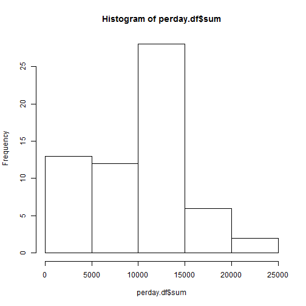
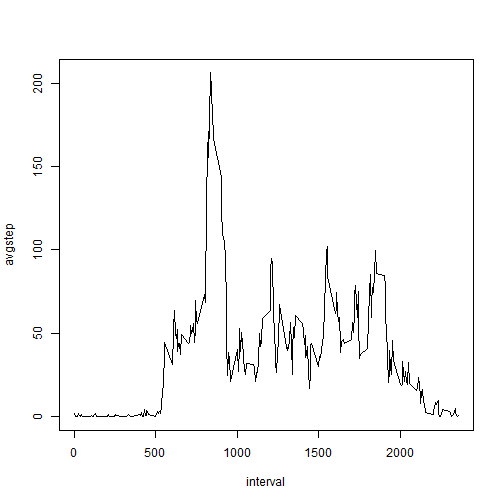
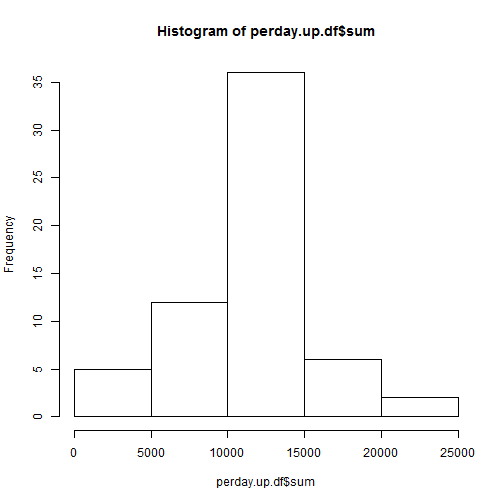

# Reproducible Research: Peer Assessment 1


## Loading and preprocessing the data
#read data

```r
move.df<-read.csv(unz("activity.zip", "activity.csv"),header=TRUE, stringsAsFactors=FALSE)
move.df$date<-as.Date(move.df$date,"%Y-%m-%d")
```
Below is the first few rows of the read in data frame. 

```r
head(move.df)
```

```
##   steps       date interval
## 1    NA 2012-10-01        0
## 2    NA 2012-10-01        5
## 3    NA 2012-10-01       10
## 4    NA 2012-10-01       15
## 5    NA 2012-10-01       20
## 6    NA 2012-10-01       25
```

## What is mean total number of steps taken per day?
After computing the average of the total steps per day, we plot the histogram.


```r
require(plyr)
```

```
## Loading required package: plyr
```

```r
perday.df<-ddply(move.df,.(date),summarise,sum=sum(steps,na.rm=T))
```

Below is a histgram of the total steps per day.

```r
hist(perday.df$sum)
```

 
Below is the average and median.


```r
mean(perday.df$sum)
```

```
## [1] 9354
```

```r
median(perday.df$sum)
```

```
## [1] 10395
```

## What is the average daily activity pattern?

Here we compute the average steps per interval.

```r
require(plyr)
```

```
## Loading required package: plyr
```

```r
stepPerInterval.df<-ddply(move.df,.(interval),
                          summarise,avgstep=mean(steps,na.r=T))
```

Below is a histogram of the average steps per interval. 

```r
plot(stepPerInterval.df,typ="l")
```

 

The interval with the maximum number of steps is computed below. 

```r
max.interval<-stepPerInterval.df[which.max(stepPerInterval.df$avgstep),"interval"]
```
The interval is 835.


## Imputing missing values
The total number of NA row are computed below. 

```r
NA.rows<-nrow(move.df[!complete.cases(move.df),])
```
The number of rows are 2304 .

We now will now fill in the missing values with the average of the interval in the entire dataset. A new data frame has been created.


```r
require(Hmisc); require(plyr)
```


```r
inpune.df<-ddply(move.df,"interval",mutate,imputed.value=impute(steps,mean))

inpune.df<-inpune.df[order(inpune.df$date),]
inpune.df$imputed.value<-round(inpune.df$imputed.value,0)

move.up.df<-inpune.df[,c(4,2,3)]

names(move.up.df)[1]<-"step"

head(move.up.df)
```

```
##     step       date interval
## 1      2 2012-10-01        0
## 62     0 2012-10-01        5
## 123    0 2012-10-01       10
## 184    0 2012-10-01       15
## 245    0 2012-10-01       20
## 306    2 2012-10-01       25
```

Below is a histogram using the new data set with the missing values filled in. 


```r
perday.up.df<-ddply(move.up.df,.(date),summarise,sum=sum(step,na.rm=T))

hist(perday.up.df$sum)
```

 

We follow with by computing a new mean and median below.

```r
mean(perday.up.df$sum)
```

```
## [1] 10766
```

```r
median(perday.up.df$sum)
```

```
## [1] 10762
```
    

## Are there differences in activity patterns between weekdays and weekends?
